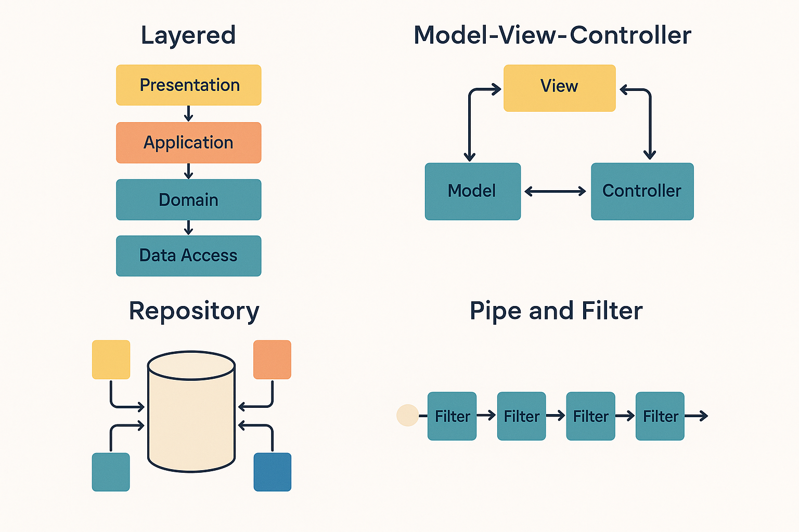

# 🏗️ Cuadro comparativo de arquitecturas de software

## 📋 Arquitecturas:

1. 🎂 Arquitectura en capas
2. 🎭 Arquitectura Modelo–Vista–Controlador (MVC)
3. 🏛️ Arquitectura de repositorio
4. 🔄 Arquitectura de tubería y filtro

---

## 📊 Cuadro comparativo

| Arquitectura                               | 📝 Descripción                                                                                                    | 🎯 Ejemplo concreto                                                    | ⏰ Cuándo se usa                                                                                          | ✅ Ventajas                                                                                  | ❌ Desventajas y limitantes                                                                                                                 |
| ------------------------------------------ | ----------------------------------------------------------------------------------------------------------------- | ---------------------------------------------------------------------- | --------------------------------------------------------------------------------------------------------- | -------------------------------------------------------------------------------------------- | ------------------------------------------------------------------------------------------------------------------------------------------- |
| **🎂 1. En capas (Layered)**               | Organiza el sistema en capas con responsabilidades claras (presentación → aplicación → dominio → acceso a datos). | App bancaria: UI móvil, servicios, dominio de negocio, DB.             | Cuando se necesita **separación de responsabilidades**, testabilidad y posibilidad de reemplazar UI o DB. | Modularidad, alta cohesión, facilidad de pruebas, permite sustituir tecnologías.             | Puede introducir **latencia**; riesgo de capas "anémicas"; flujo verboso si la lógica cruza muchas capas.                                   |
| **🎭 2. Modelo–Vista–Controlador (MVC)**   | Divide en modelo (lógica/datos), vista (UI) y controlador (flujo de interacción).                                 | E-commerce: controladores HTTP, modelos de Pedido, vistas de catálogo. | Aplicaciones con **interfaces ricas** y múltiples vistas; frameworks web/móvil.                           | Acelera desarrollo de UI, separación de preocupaciones, múltiples vistas de un mismo modelo. | Puede derivar en **controladores gordos**; riesgo de acoplamiento vista-controlador; mezcla de dominio y detalles web si no hay disciplina. |
| **🏛️ 3. Repositorio**                      | Subsistemas comparten un **almacén de datos central** como fuente de verdad.                                      | Plataforma de analítica con Data Lake centralizado.                    | Cuando se requiere **consistencia fuerte**, auditoría o fuente única de verdad.                           | Control central de seguridad, evita duplicación de datos, facilita reporting.                | Puede ser **cuello de botella**; punto único de falla; acoplamiento por esquema compartido; evolución sensible.                             |
| **🔄 4. Tubería y Filtro (Pipe & Filter)** | Procesa datos en un **flujo** secuencial a través de filtros conectados por tuberías.                             | ETL de datos: Extracción → Limpieza → Enriquecimiento → Carga.         | Procesamiento **streaming** o batch secuencial; escenarios de composición de etapas.                      | Alta componibilidad, escalado por filtro, buena observabilidad de etapas.                    | Difícil manejar transacciones multi-etapa, latencia si la cadena es larga, manejo de errores complejo.                                      |

---

## 🎯 Diferenciación de escenarios

-  🎨 **Interfaces ricas y evolución rápida de UI** → **MVC** sobre una base en **capas**.
-  🔧 **Negocio estable y necesidad de sustituir UI o DB sin tocar dominio** → **En capas**.
-  🏢 **Múltiples sistemas compartiendo datos con auditoría** → **Repositorio**.
-  📊 **Procesamiento de datos secuencial o streaming** → **Tubería y filtro**.
-  🔗 **Mixto**: común combinar (ej. UI en MVC + backend en capas + pipeline de datos).

---

## ⚖️ Análisis de ventajas y limitaciones

1. **🛠️ Mantenibilidad vs. ⚡ Rendimiento**

   -  En capas/MVC → mejor mantenibilidad pero más latencia.
   -  Priorizar según si el cliente valora más **flexibilidad** o **rendimiento extremo**.

2. **📐 Consistencia vs. 📈 Escalabilidad**

   -  Repositorio → garantiza consistencia, pero puede ser cuello de botella.
   -  Ideal para control centralizado, no tanto para escalado global.

3. **🧩 Componibilidad vs. 🔄 Transaccionalidad**

   -  Tubería y filtro → gran composición, pero difícil manejo de transacciones completas.
   -  Útil si se tolera reprocesamiento e idempotencia.

4. **🔄 Evolución del dominio**
   -  En capas/MVC → mejores para cambios frecuentes y separación de responsabilidades.
   -  Repositorio → más rígido y sensible a cambios de esquema.

---

## 💡 Consejos prácticos

-  🎯 Define **límites de dominio** antes de elegir estilo arquitectónico.
-  📋 Usa contratos estables entre capas/filtros (DTOs, eventos).
-  🏛️ En repositorio: planifica gobernanza y migraciones versionadas.
-  🎭 En MVC: evita controladores "dios" y delega lógica al dominio.
-  🔀 Combina estilos intencionalmente según necesidades del cliente.
